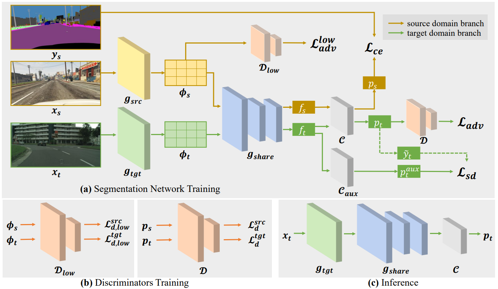

# DecoupleNet
Official implementation for our ECCV 2022 paper "DecoupleNet: Decoupled Network for Domain Adaptive Semantic Segmentation" [[arXiv](https://arxiv.org/pdf/2207.09988.pdf)] [[Paper](https://www.ecva.net/papers/eccv_2022/papers_ECCV/papers/136930362.pdf)]

<div align="center">
  
</div>

# Get Started

## Datasets Preparation

### GTA5
First, download GTA5 from the [website](https://download.visinf.tu-darmstadt.de/data/from_games/). Then, extract them and organize as follows.
```
images/
|---00000.png
|---00001.png
|---...
labels/
|---00000.png
|---00001.png
|---...
split.mat
gtav_label_info.p
```

### Cityscapes

Download Cityscapes dataset from the [website](https://www.cityscapes-dataset.com/). And organize them as 
```
leftImg8bit/
|---train/
|---val/
|---test/
gtFine
|---train/
|---val/
|---test/
```

## Training

### GTA5 -> Cityspcaes
First, download the pretrained ResNet101 (PyTorch) and sourceonly model from [here](https://mycuhk-my.sharepoint.com/:u:/g/personal/1155154502_link_cuhk_edu_hk/EVowKrywcUVJhK0tbO_ebxQBv83FCISbGW_2fTeCWiFvGA), and put them into the directory `./pretrained`.
```
mkdir pretrained && cd pretrained
wget https://download.pytorch.org/models/resnet101-5d3b4d8f.pth
# Also put the sourceonly.pth into ./pretrained/
```

First-phase training:
```
python3 train_phase1.py --snapshot-dir ./snapshots/GTA2Cityscapes_phase1 --batch-size 8 --gpus 0,1,2,3 --dist --tensorboard --batch_size_val 4 --src_rootpath [YOUR_SOURCE_DATA_ROOT] --tgt_rootpath [YOUR_TARGET_DATA_ROOT]
```

Second-phase training (The trained phase1 model can also be downloaded from [here](https://mycuhk-my.sharepoint.com/:f:/g/personal/1155154502_link_cuhk_edu_hk/EmhCkQ_lJ1FLr9Dj2QopYHkB4gyXPOC2BUzjmw4jGq6FSQ?e=m8XPfC)):
```
# First generate the soft pesudo labels from the trained phase1 model
python3 generate_soft_label.py --snapshot-dir ./snapshots/GTA2Cityscapes_generate_soft_labels --batch-size 8 --gpus 0,1,2,3 --dist --tensorboard --batch_size_val 4 --resume [PATH_OF_PHASE1_MODEL] --output_folder ./datasets/gta2city_soft_labels --no_droplast --src_rootpath [YOUR_SOURCE_DATA_ROOT] --tgt_rootpath [YOUR_TARGET_DATA_ROOT]

# Then, get the thresholds from the generated soft labels: 
cd datasets/ && python3 get_thresholds.py 0.8 gta2city_soft_labels

# Training with soft pseudo labels:
python3 train_phase2.py --snapshot-dir ./snapshots/GTA2Cityscapes_phase2 --batch-size 8 --gpus 0,1,2,3 --dist --tensorboard --learning-rate 5e-4 --batch_size_val 4 --soft_labels_folder ./datasets/gta2city_soft_labels --resume [PATH_OF_PHASE1_MODEL] --thresholds_path ./datasets/gta2city_soft_labels_thresholds_p0.8.npy --src_rootpath [YOUR_SOURCE_DATA_ROOT] --tgt_rootpath [YOUR_TARGET_DATA_ROOT]
```

# Acknowledgement
This repository borrows codes from the following repos. Many thanks to the authors for their great work.

ProDA: https://github.com/microsoft/ProDA

FADA: https://github.com/JDAI-CV/FADA

semseg: https://github.com/hszhao/semseg

# Citation
If you find this project useful, please consider citing:

```
@inproceedings{lai2022decouplenet,
  title={Decouplenet: Decoupled network for domain adaptive semantic segmentation},
  author={Lai, Xin and Tian, Zhuotao and Xu, Xiaogang and Chen, Yingcong and Liu, Shu and Zhao, Hengshuang and Wang, Liwei and Jia, Jiaya},
  booktitle={European Conference on Computer Vision},
  pages={369--387},
  year={2022},
  organization={Springer}
}
```